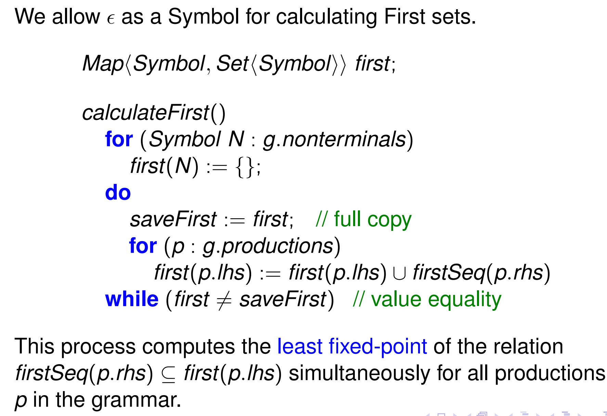
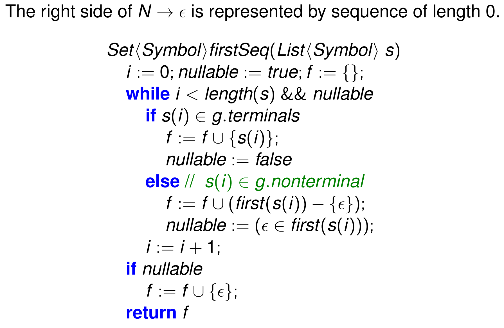
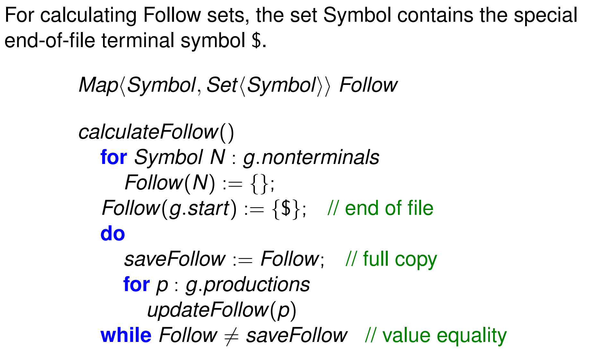
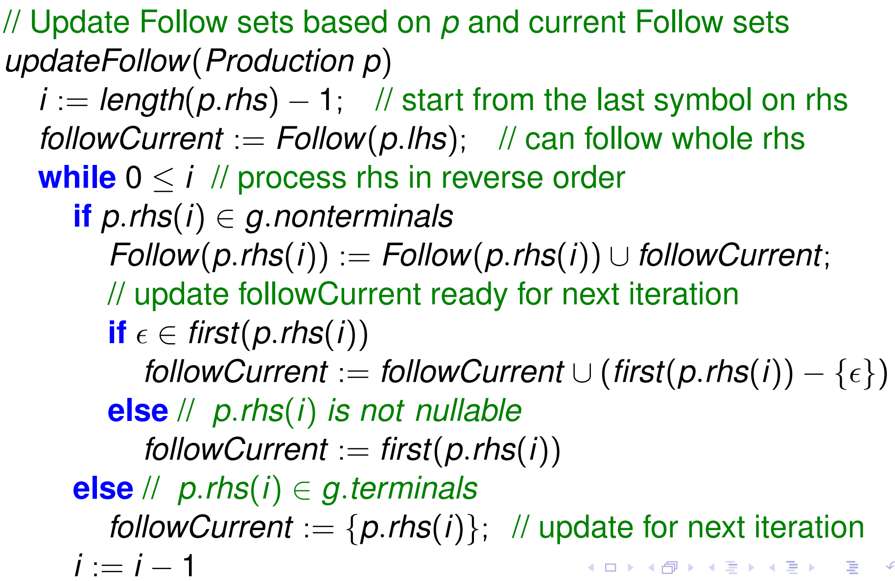

# Lecture 10 - First and Follow Sets, LL-1 Grammars

> March 30,  2020

In predictive RDP, we need to choose between alternatives based on the current token. To do this, we need to know:

- what tokens each alternative can begin with, the **first set**, and
- if a construct is nullable, to choose between the empty string or a non-empty string, we need to know what symbols can **follow** this construct.

The first set for a construct $\alpha$, denoted $\text{First}(\alpha)$ records

- the set of terminal symbols which can start $\alpha$, and
- if $\alpha$ is nullable, it additionally contains $\epsilon$.

Importantly, note that $\epsilon$ is not a terminal here. It is only included to signify a construct is nullable.

**Definition (First set).** If $\alpha$ is not nullable, the first set is $\text{First}(\alpha) = \{ a : \text{Terminal} ~|~ \exists \beta : \alpha \overset *\Rightarrow a \beta\}$. If $\alpha$ is nullable, this set additionally contains $\epsilon$.

This can be computed quite intuitively. However, if we have a sequence $S_1 S_2$, the first set is something like
$$
\text{First}(S_1 S_2) = \text{First}(S_1) \setminus\{\epsilon\} \cup \text{First}(S_2) \setminus S_2 \cdots \cup \{\epsilon\}
$$
Note that the later first sets are only included if all preceding symbols are nullable, and $\epsilon$ is only included in the final first set if the string as a whole is nullable. We exclude $\epsilon$ from the individual first sets of $S_1$, etc, because nullability of $S_1$ does not imply nullability of $S_1 S_2 \ldots$.

Briefly, first sets can be computed algorithmically with the following basic rules:

> $\text{First}(S_1 | S_2) = \text{First}(S_1) \cup \text{First}(S_2)$

**Definition (Follow set).** A non-terminal $N$ is followed by a terminal $a$ if there exists a derivation from $S\$$ in which $a$ follows $N$. More formally,
$$
\text{Follow}(N) = \{ a : \text{Terminal} ~|~ \exists \alpha, \beta : S$ \overset*\Rightarrow \alpha Na \beta\}.
$$
Note that follow sets only include terminal symbols and may include $\$$, which only appears at the end of an input string. Note that first sets never include EOF and follow sets never include $\epsilon$.

There are some simple rules:

- $\$ \subseteq \text{Follow}(S)$,
- if $A \to \alpha N \beta$, then $\text{First}(\beta) \setminus \{\epsilon\} \subseteq \text{Follow}(N)$,
- if $A \to \alpha N \beta$ and $\beta$ is nullable, $\text{Follow}(A) \subseteq \text{Follow}(N)$.

## LL(1) grammars

The class of grammars which can be parsed by recursive descent predictive parsing with single symbol lookahead is called LL(1). 

- The first L refers to the fact that parsing is *left to right*.
- The second L refers to the fact that the parsing produces a *leftmost derivation* sequence.
- The 1 indicates the parser only looks ahead *one symbol*, the current token.

**Definition (LL(1) grammar).** A BNF grammar is LL(1) if for each non-terminal $N$ where $N \to \alpha_1 ~|~ \cdots ~|~ \alpha_n$,

- the first sets of any two alternatives, $\text{First}(\alpha_i)$ and $\text{First}(\alpha_j)$, are pairwise disjoint when $i \ne j$, and
- if $N$ is nullable, $\text{First}(N)$ and $\text{Follow}(N)$ are disjoint.

Because the first set contains $\epsilon$ if the alternative is nullable, the first constraint implies that at most one alternative can be nullable.

Given an LL(1) grammar, during recursive descent parsing, the current token is either

- in the first set of exactly one alternative,
- in the follow set of $N$ and the (unique) nullable alternative is chosen, or
- invalid and hence a syntax error.

An EBNF grammar is LL(1) if it is LL(1) when converted to a BNF grammar.