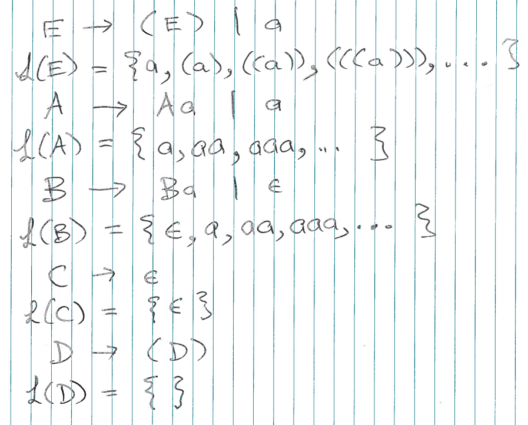
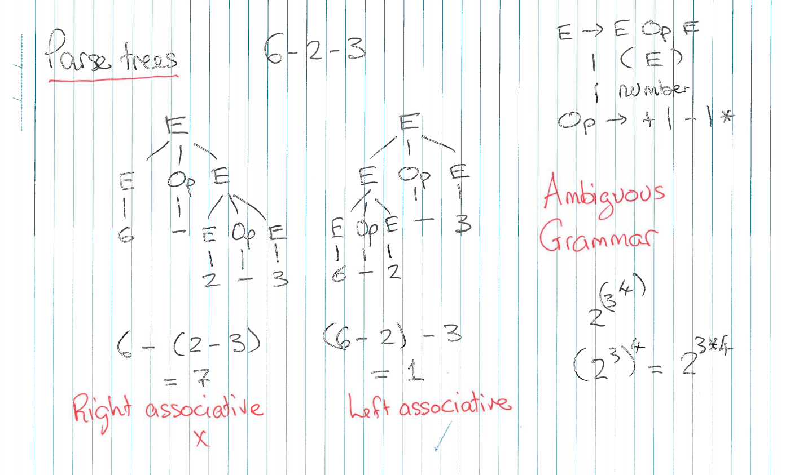

# Lecture 2 &mdash; Context-Free Grammars

Recall the phases of a compiler from last lecture. We're going to be focusing on syntax analysis for the next few lectures.

## Context-free grammars

By convention, to define a context-free grammar, it is sufficient to define a list of productions:
$$
\begin{aligned}
E &\to E\ Op\ E \\ 
E &\to ``("\ E\ ``)" \\ 
E &\to \textit{number} \\ 
Op &\to ``+"\\
Op &\to ``-"\\
Op &\to ``*"
\end{aligned}
$$
This has start symbol $E$, nonterminals $\{E, Op\}$ and terminals $\{``(", ``)", \textit{number},  ``+",  ``-",  ``*"\}$.

> A **context-free grammar** consists of
> - a finite set of terminal symbols $\Sigma$,
> - a finite, non-empty set of nonterminal symbols (disjoint from the terminals),
> - a finite, non-empty set of productions $A \to \alpha$, where $A$ is a nonterminal and $\alpha$ is a possibly empty sequence of nonterminal or terminal symbols, and
> - a start symbol which is nonterminal.

### Derivation sequences
Productions can be used to rewrite strings of symbols. A leftmost derivation sequence for $3-4-2$ is 
$$
\begin{aligned}
E &\Rightarrow E\ Op\ E\\
&\Rightarrow E\ Op\ E\ Op\ E\\
&\Rightarrow 3\ Op\ E\ Op\ E\\
&\Rightarrow 3\ -\ E\ Op\ E\\
&\Rightarrow 3\ -\ 4\ Op\ E\\
&\Rightarrow 3\ -\ 4\ -\ E\\
&\Rightarrow 3\ -\ 4\ -\ 2\\
\end{aligned}
$$
The leftmost nonterminal is expanded at each stage.

The process of expanding $3-4$ goes something like this:
1. Start with the start symbol. Which of the 3 alternatives do we choose? The first (somewhat arbitrarily).
2. Then, we expand the left $E$ to the number 3.
3. And so on.

### Derivations
Given a production $N \to \gamma$, a **direct derivation** is 
$$
\alpha N \beta \Rightarrow \alpha \gamma \beta.
$$
A **derivation** is a sequence of 0 or more direct derivations. It is written $\alpha \xRightarrow * \beta$ and read "$\alpha$ derives $\beta$".

### Nullables

A possibly empty sequence $\alpha$ is **nullable** if it can derive the empty string, often denoted $\epsilon$. There are some rules:
- $\epsilon$ is nullable,
- any terminal is non-nullable,
- a sequence is nullable only if all items are nullable,
- a set of alternatives is nullable if any is alternative nullable, 
- EBNF optionals and repetitions are nullable, and
- a non-terminal $N$ is nullable if some production of $N$ has a nullable right-hand side.

### Languages and sentences

The **formal language** $\mathcal L(G)$ of some grammar $G$ is the set of all finite sequences of terminals derivable from the start symbol $S$ of $G$. That is, 
$$
\mathcal L(G) = \{t \in \operatorname{seq}\Sigma ~|~ S \xRightarrow *t\}.
$$

A **sentence** is a sequence of terminals derivable from the start symbol, $S \Rightarrow t$.

A **sentential form** is a sequence of terminal and/or non-terminals derivable from the start symbol, $S \xRightarrow{*} \alpha$.

_Examples of languages:_
.

## Parse trees

This grammar is *ambiguous*, which is usually bad. A derivation sequence of a sentnece has a corresponding parse tree. 

A grammar $G$ is **ambiguous for a sentence** $t$ if there is more than one parse tree for $t$.

A grammar $G$ itself is **ambiguous** if any sentence is ambiguous.

### Associativity

To remove ambiguity, we can enforce left or right associativity into the grammar. For left-asssociative,
$$
\begin{aligned}
E &\to E\ ``-"\ T \\ 
E &\to T \\ 
T &\to N
\end{aligned}
$$
For right,
$$
\begin{aligned}
E &\to T\ ``-"\ E \\ 
E &\to T \\ 
T &\to N
\end{aligned}
$$

### Precedence
A grammar like 
$$
\begin{aligned}
E &\to E\ ``+"\ E \\ 
E &\to E \ ``*"\ E \\ 
E &\to N
\end{aligned}
$$
is ambiguous because the order is not specified. To ensure $+$ has lower precedence (and is left associative), we can rewrite it as the following:
$$
\begin{aligned}
E &\to E\ ``+"\ T ~|~T \\ 
T &\to T \ ``*"\ F ~|~ F \\ 
F &\to N\ |\ ``("\, E\, ``)"
\end{aligned}
$$
This grammar is unambiguous. That is, it treats $+$ as lower precedence than $*$ unless it is surrounded by parentheses.
