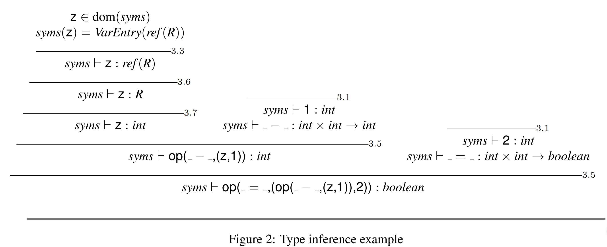

# Lecture 6 &mdash; Static Semantic Analysis

At the top level, a program is just a block and a block contains declarations then the main body. Declarations are a mapping from an identifier to a declaration.

Statements are assignments, writes, reads, calls, if, while, or statement lists.

Expressions can be numbers, lvalues, unary operators, binary operators, or a 'narrow' which narrows an expression to a subrange.

We need to know the types of all the identifiers as they're declared. This is represented as a mapping, or symbol table. We also need to know the types of operators, such as $+ : \mathbb Z \times\mathbb Z \to \mathbb Z$.

If we declare $x$ to be an integer, internally we know it is a "ref int" or a reference to an integer. 

The symbol table stores ConstEntry, TypeEntry, VarEntry, or ProcEntry. For example, the code
```
const C = 42;
type S = [-C..C];
var b : boolean;
    y : S;
```
has the following symbol table
> C &#8614; ConstEntry(int, 42)
> S &#8614; TypeEntry(subrange(int, -42, 42))
> b &#8614; VarEntry(ref(boolean))
> y &#8614; VarEntry(ref(subrange(int, -42, 42)))

### Type inference rules

Something like $\textit{syms} ~\vdash n : \text{int}$ (**integer value**) means that given a symbol table _syms_, any number is of type int.


There are other rules in the PL0-SSemantics.pdf document. Note that narrowing subranges may require a runtime check or more advanced static analysis.


