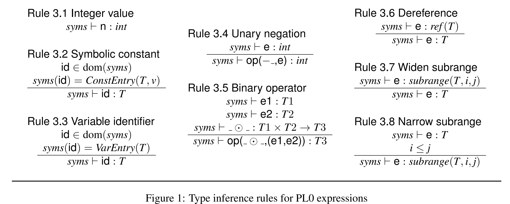
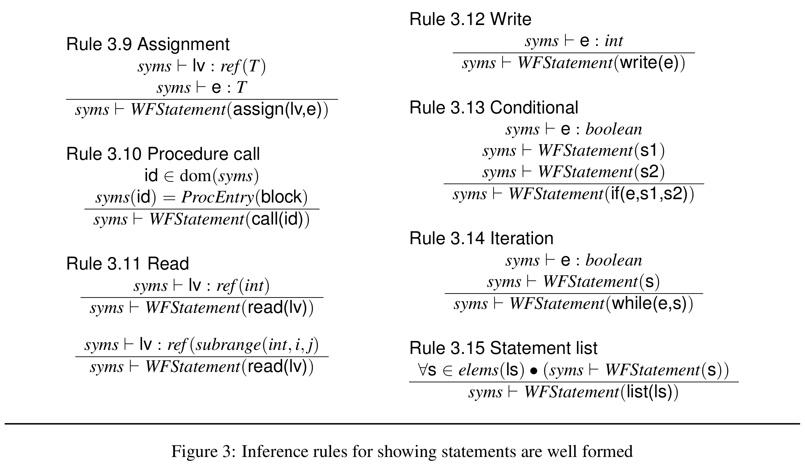
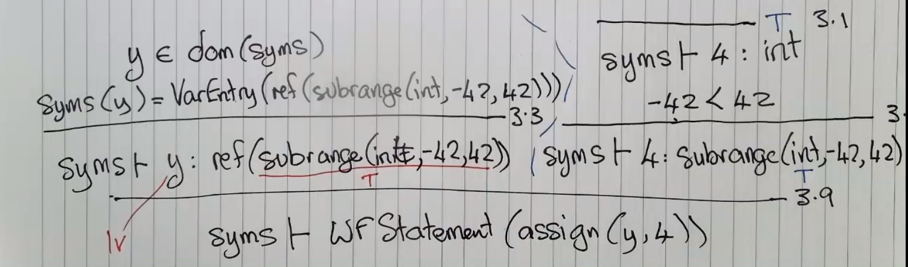
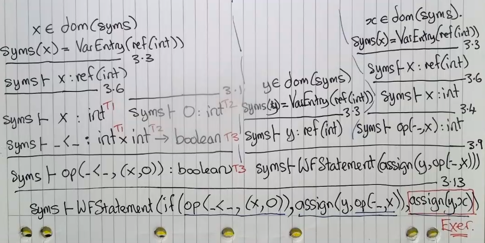

# Lecture 7 &mdash; Static Semantic Analysis (2)

Recall the type inference rules:



Also, remember that for all variables, the entry in the symbol table will be a type "ref(T)".

In this language, statements don't have a particular type. They are either well-formed or not. In our rules, we only deal with "WFStatement".



These give rules for when a statement is considered well-formed.

Consider the following example:

```
type s = [-42..42];
var y : S;
    y := 4;
```





## The PL0 Compiler (Assignment)

### Visitor Pattern

We need to write a class which visits each type of node.

Tree nodes have a function `accept(Visitor v)` which calls `v.visitXTree()`, and the Visitor class has methods `visitXTree` which call accept on the relevant children.