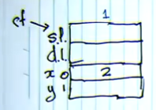
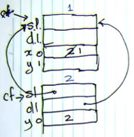
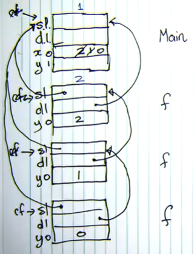

# Lecture 8 &mdash; Constant Expressions

> Assignment 1 deadline has been pushed back to Thursday, 9th April.

Let's look at constants. The only operation we can do on constants is negation. They can also refer to other constants, but we need to be careful of circular references. In the compiler, constant expressions have 3 states: unresolved, resolving and resolved. 

```
const A = -27;
      C = -D;
      D = -C;
      E = 5;
```

A number is initially resolved because it has an obvious value. A negate node can be evaluated by negating its subexpression value. A constant node needs to detect and invalidate circular constants by making use of the "resolving" state. A constant identifier should only ever be evaluated once (I believe).

A similar circular definition can occur with types. They are handled in the same way.

## The Interpreter

In this course, we're looking at two different ways of executing programs: an interpreter and code generation (for a stack machine).

It makes use of the visitor pattern, but using values instead of nodes. 

For each procedure call, there is a stack frame which contains space for variables (entries), its procedure, and other information. There are various functions to visit different types of nodes, which return Value subclasses. 

- The value returned for a variable is an address, which has a level and offset. 
- The value of visiting a binary node is an integer value, resulting from the evaluation of the operation. Logical values are internally treated as 1 and 0.
- Similarly for a unary node, we evaluate return the result.
- A dereference node gets the left-value and evaluates it by locating its containing frame and offset. Unassigned variables are detected by null inside the frame.
- Visit a narrow subrange node evaluates the expression, then does a runtime check to ensure the value is within the subrange.
- Widen will always succeed so just returns the integer.
- Visitng a statement list node just calls 'accept' for each statement in the list. 
- An assignment evaluates the left and right sides. Left should be an address and right should be an integer, then it assigns the variable to the left-value.
- Call sets up a new frame for the function's variables, then executes the function block using 'accept'. The previous frame is restored after exiting the function.
- An if statement evaluates the condition, then calls the appropriate block depending on if it was true or false.
- A while node is similar.

### An example of stack frames

```
var x : int;
	y : int;
procedure f() =
	var y : int;
	begin
		y := x;
		if x > 0 then
		begin
			x := x-1;
			call f();
		end
		else
			y := x;
        write y
    end;
begin
	x := 2;
	call f()
end
```

Let's look at the stack frame for this (nonsense) program. A stack frame contains a static link and dynamic link, then an array of variable entries.

First, we assign 2 to $x$ within the Main frame:



Then, we construct a new frame for $f$. The static link here is a pointer to the closest program which directly includes it. Here, it will be a pointer up to the main frame. The dynamic link always points to the procedure or main program which called $f$. In this case, it is also main.

We find the value of $x$ by looking up the frames, then store that into $y$. Then, we decrement $x$ because $x > 0$.



We construct a new stack frame. The static link will be to main, the dynamic link will be to the first $f$ frame. 

Then we call $f$ again, with similar results. Now, $x$ is not $>0$ so we assign $x$ to $y$, then write out $y$ and return.



When we return, that means we throw away the last frame, then go back and write $y$ in the 2nd $f$ frame, then go up and write $y$ in the 1st frame, then go back to main, then terminate.