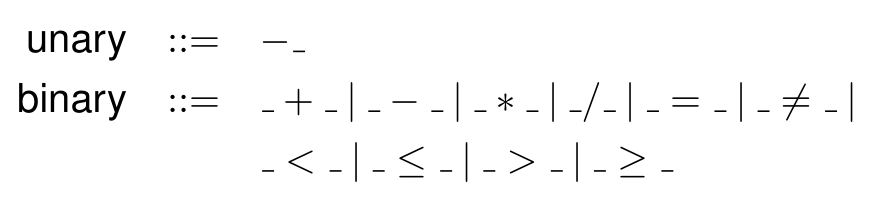

A quick reference on static semantics of the PL0 programming language. This is meant to be read alongside `PL0-SSemantics.pdf`. Written by Kenton Lam.

## Abstract Syntax

## Notation

- Abstract syntax is written in sans-serif font. For example the expression `y+1` in code is written as $\textsf {y} + 1$ here. This corresponds to expression nodes and statement nodes.
- Semantic constructs are written in $\textit{italics}$. For example, the type $\operatorname{\textit{ref}}\,(T)$. These are most commonly types or other static checker constructs like the symbol table.
- The use of arrows is very precise:
  - $\to$ denotes functions,
  - $\mapsto$ denotes mapping values, 
  - $\overset e\to$ denotes evaluates to, and
  - $\to$ with a vertical line in the centre denotes a mapping type (we will use $\twoheadrightarrow$ here because I can't type it).
- A bullet $\bullet$ is used to separate quantifiers from their predicate.
- $=$ denotes equivalence in the mathematical sense (a strong statement).

With the above in mind, we define a few more high-level pieces.

- A mapping $M$ of $a \twoheadrightarrow b$ has some operations defined:

  - $\operatorname*{dom}(M)$ returns the set of $a$ keys in the mapping, 
  - $M(a)$ returns the $b$ value mapped to by the key $a$, and
  - $M_1 \oplus M_2$ returns a mapping containing the entries of both $M_1$ and $M_2$, with entries in $M_2$ overriding $M_1$ if both are present.

- $\textit{syms}$ is defined as a mapping $\textsf{id} \twoheadrightarrow \textit{SymEntry}$ of AST identifiers to symbol table entries, so $\operatorname*{dom}(\textit{syms})$ is the set of defined identifiers. A symbol table entry is a sum type defined as
  $$
  \begin{aligned}
  \textit{SymEntry} &::= \textit{ConstEntry}(T, \mathbb Z) \mid \textit{TypeEntry}(T) \\
&\qquad\mid \textit{VarEntry}(T) \mid \textit{ProcEntry}(\textsf{block}).
  \end{aligned}
  $$
  
- $\textit{syms} \vdash \textsf e : T$ means in the context of the symbol table $\textit{syms}$, the expression $\textsf e$ is well-typed and has the type $T$.

## Declarations

There are four forms of declarations: constants, types, variables, and procedures. The notation $\textit{syms} \vdash \textit{WFDeclaration}(\textsf d)$ means that $\textsf d$ is a well-formed declaration in the context of $\textit{syms}$. Furthermore,
$$
\textit{entry}(\textit{syms}, \textsf d)=\textit{ent}
$$
is used to assign $\textit{ent}$ to the symbol table entry of $\textsf d$. This formally assigns a SymEntry to a particular declaration form $\textsf{d}$. Perhaps more rigorously, the statement
$$
\textit{entry}(\textit{syms}, \textsf{var}(\textsf{t})) = \textit{VarEntry}(\textit{ref}(T))
$$
means that a declaration of the form $\textsf{var}(\textsf{t})$ should have a corresponding VarEntry table when interpreted in the context of $\textit{syms}$. 

The declaration rules use pattern matching in their consequents, which means only expressions of a certain form can be well-formed declarations. This prevents us from declaring a type of, say, $1+10$.

## Types

These rules concern the definition of types in PL0 program (e.g. type aliases and subrange types). 

We introduce a function $\textit{typeof}$ such that $\textit{typeof}(\textsf{e}) =T$ means the given expression **is** (i.e. defines) the type $T$. This is at a higher level of abstraction than $\textsf{e} : T$ which means $\textsf{e}$ is a value of type $T$.

## Blocks

These are perhaps the most complex because they must consider everything discussed already, as well as locally declared types, variables, and scope.

Note that a well-formed block cannot define an identifier more than once. This is represented (theoretically) by $\textsf{ds}$ being a mapping. A block defines a new scope in which its local declarations shadow its parents identifiers if they have the same name. In doing so, it constructs symbol table entries from its declaration list.

The function $\textit{uses}$ takes a declaration, type or constant expression and returns the identifiers used by its types. For example, $\textit{uses}(\textsf{id})=\{\textsf{id}\}$ and $\textit{uses}(\textsf{var}(\textsf{t}))=\textit{uses}(\textsf t)$.

The $\textit{entryDecl}(\textit{syms}, \textsf{ds}, \textsf d)$ function _defines_ a symbol table entry for the declaration $\textsf{d}$ in a context of $\textit{syms}$ augmented with only the declarations from $\textsf{ds}$ which are used in $\textsf{d}$. The $\textit{uses}(\textsf{d})$ prevents mutual recursion in rule 6.2 between declarations in the same declaration list. Basically, this constructs a new context and offloads the work to $\textit{entry}$.

The earlier $\textit{entry}$ function returns the appropriate symbol table entry for a given declaration in a given context. Importantly, this means that types and their SymEntries are constructed in the context they're defined. Putting this together, we get the following rules for well-formed blocks.

Intuitively, the predicate of rule 6.1 does the following:

- Constructs a mapping of identifiers to the identifiers they use and computes its transitive closure (denoted by superscript $+$).
- Ensures that no identifier uses itself directly or indirectly, preventing recursion in the types.
- Constructs a new scope $\textit{syms}'$ by adding the new declarations and computing their symbol table entries using $\textit{entryDecl}$ (discussed above).
- Ensures that every new declaration is well-formed in the new context.
- Ensures that in the new context, the statement list is well-formed.

If all of the above hold, the block as a whole is well-formed.

A _program_ is well-formed if its block is well-formed in the context of the $\textit{predefined}$ context.

## Rules

### Types of Expressions

### Well-Formed Statements

### Well-Formed Declarations

#### Constant Evaluation Rules

### Well-Formed Types

### Well-Formed Blocks

### Well-Formed Main Program

