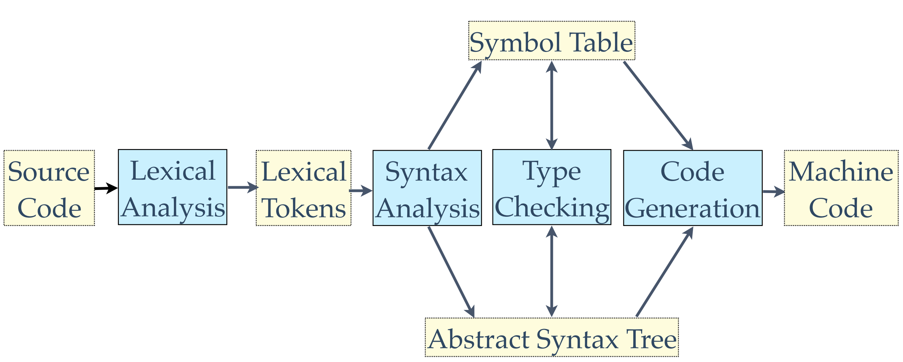
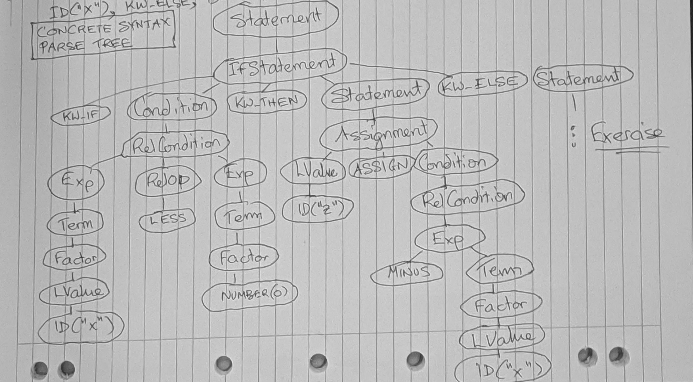
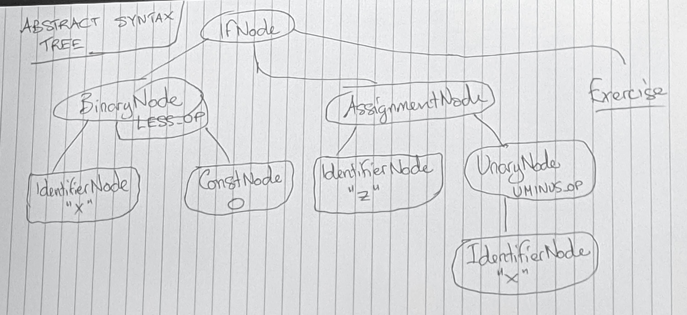

# Lecture 1 &mdash; Compilers and Interpreters

**Ian Hayes**: [ian.hayes@uq.edu.au](ian.hayes@uq.edu.au), 78-414 (GP South).

### Administrative notes
Piazza will be used for general notices and administration. A link is in email. Please, don't post your assignment solutions on Piazza.

The course has a website, with weekly readings and notes, [here](https://learn.uq.edu.au/bbcswebdav/pid-4972733-dt-content-rid-22842531_1/courses/COMP4403S_7020_21490/index.html). This course may be "very hard" if you do not have the prerequisite programming experience.

## Introduction

Modifying a compiler will form part of an assignment. This compiler is written in Java and on the order of 1000s to 10000s of lines of code.

We do use a reasonable amount of Java's features, such as generics, utilities and lambda notation. There are a few data structures built-in, and understanding them is useful (e.g. symbol table, AST).

Initially, we will use a interpreter then move into generating code. We will use a stack machine instead of a real machine, to simplify code generation.

### Resources
The textbook for this year is Aho's _Compilers: Principles, Techniques, and Tools_. The previous book, Louden's _Compiler Construction - Principles and Practice_, can also be used. There is a website for converting references between the two.

### Assessment

3 assignments, each worth 20%. Final exam worth 40%.

## Phases of a compiler



For an **interpreter**, it is identical except instead of code generation and machine code, there is an interpreter which directly evaluates the AST and symbol table.

#### Lexical analysis
Input is a sequence of characters representing a program and the output is a sequence of lexical tokens. Lexical tokens can be identifiers, constants, keywords, etc. Whitespace and comments are ignored, but can separate tokens.

#### Syntax analysis
Input is a sequence of lexical tokens and its output is an abstract syntax tree (AST) and symbol table. The symbol table contains all identifiers defined within the program as well as bulitin types. May be organised into scopes, e.g. identifiers defined only within a procedure.

#### Type checking (aka static analysis)
Input is an AST and symbol table and output is an updated symbol table and AST. Resolves all references to identifiers, updating symbol table with type information, checking AST for type correctness and updating it in the case of type casts.

#### Code generation
Input is the AST and updated symbol table and output is code for a target machine. May include machine-independent or -dependent optimisations, instruction selection and register allocation.

In this course, we won't cover much on optimisation due to lack of time. Because we're using a stack machine, code generation is fairly simple.

#### Interpreter
Input is AST and updated symbol table. Interprets the AST directly to execute the program. Less time is spent compiling, at the cost of slower execution. Commonly used for high-level dynamically-typed languages.

## PL0 programming language

This is the programming language we will be working with through this course. It is designed for teaching and similar to Pascal.

The PL0 concrete syntax can be found [here](https://learn.uq.edu.au/bbcswebdav/pid-4972733-dt-content-rid-22842531_1/courses/COMP4403S_7020_21490/notes/PL0-CSyntax.pdf).

### Example
Consider the following snippet of PL0 code:
```
if x < 0 then z := -x else z := x
```
Converting to lexical tokens, it becomes: KW_IF, ID("x"), LESS, NUMBER(0), KW_THEN, ID("z"), ASSIGN, MINUS, ID("x"), KW_ELSE,  ID("z"), ASSIGN, ID("x").

### Concrete syntax parse tree

**Terminals** form leaf nodes in our parse tree. In this case, terminals are the lexical tokens.

Note that the EBNF 
> _Exp_ → [PLUS | MINUS] Term {(PLUS | MINUS) Term}
> _Term_ → Factor {(TIMES | DIVIDE) Factor}
> _Factor_ → LPAREN Condition RPAREN | NUMBER | LValue

ensures that TIMES and DIVIDE have higher precedence than PLUS and MINUS. This is because the smallest unit is the _Term_. This also allows parens to have the highest priority.

Below is the concrete parse tree. Note that an **in-order** traversal of the tree will visit all leaf nodes in the same order as the original input. The tree expresses the structure of the program. However, the program cannot be exactly recreated because whitespace and comments are lost.



### Abstract syntax tree

The compiler documentation can be found [here](https://learn.uq.edu.au/bbcswebdav/pid-4972733-dt-content-rid-22842531_1/courses/COMP4403S_7020_21490/notes/PL0-Compiler.pdf). It contains descriptions of the relevant AST nodes.

The concrete tree is quite verbose. That is, there is a lot of noise needed to define the semantics of the language, such as _Term_ and keywords. The AST strips this away.



### Type checking

IdentiferNode is an intermediate node. It is either a constant defined in the source code (i.e. a literal) or a variable, which needs to be treated different. The reason why is a variable can be changed. A variable should be thought of as a reference or location which contains a mutable value.

For example, we convert IdentifierNode("x") to VariableNode("x") with the type of ref(int).
ConstNode(0) has the type int. However, because this is used as part of a BinaryNode with less-than, we need to dereference the left ref(int) to a int. This is done by inserting a DereferenceNode, giving us a int type.

In the IdentiferNode("z") under AssignmentNode, it becomes a VariableNode("z") of type ref(int). It is important that the left hand size of an assignment is a reference. It doesn't make sense to assign something to an integer.


