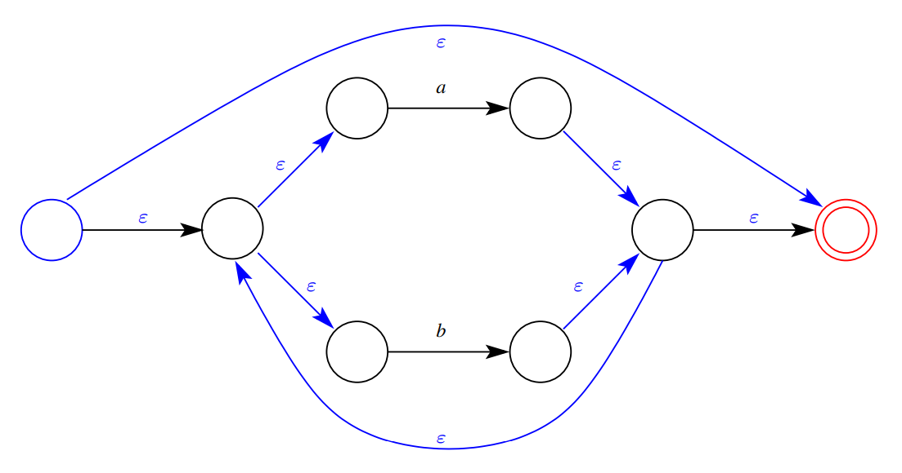

# Week 10.2 &mdash; Lexical Analysis, Regex, NFA, DFA

Lexical analysis is handled by JFlex using regular expressions. These are converted to a deterministic finite automata which recognises the tokens. DFA recognises are very fast, $O(n)$ in the length of the input. To create a DFA, it creates an intermediate NFA. The final DFA can be minimised to reduce its size.

The difference between a DFA and an NFA is that a DFA does not allow empty transitions (transition on $\epsilon$) or multiple transitions on the same symbol. The automata above both recognise the same language $\text{a b} ~|~ \text c$.

## Regular expressions

**Definition (Regular expression).** The syntax of regular expressions in BNF is
$$
\textit e := \textit a \mid \epsilon \mid \emptyset \mid e\text{``|"}e \mid e\,e\mid e\text{``*"}\mid \text{``}(\text{"} e\text{``}(\text{"}
$$
where $\textit a$ is some symbol from the alphabet $\Sigma$. Repetition has higher precedence than concatenation, which has higher precedence than alternation.

**Definition (Language of regular expressions).** Given an alphabet $\Sigma$, a regular expression defines a language (i.e. a set of strings from the alphabet). A regular expression has languages of these particular forms:

Concatenation and iteration work the way we would expect. For example,

Note that this language has infinitely many strings but does not include strings of infinite length.

## Finite automata

A finite automaton is a finite state machine with labelled transitions between states. Each transition is labelled with a symbol or the empty string.

For a deterministic finite automaton, empty transitions are not allowed and multiple transitions from the same state on the same symbol are not allowed.

**Definition (DFA).** A deterministic finite automaton $D$ consists of

- a finite alphabet $\Sigma$,
- a finite set of states $S$, 
- a transition function $T : \Sigma \times S \to S$ which may be non total,
- a start state $s_0$, and
- a set of final/accepting states $F$.

_Example:_ The DFA from above is defined as follows. Note the transition function is not defined for all combinations of state and symbol.

**Definition (Language of a DFA).** The language $\mathcal L(D)$ of a DFA is the set of finite strings of symbols from $\Sigma$ such that $c \in \mathcal L(D)$ if and only if there is some sequence of states such that
$$
T(c_1, s_0) = s_1,\quad T(c_2, s_1)=s_1, \quad\ldots, \quad T(c_n, s_{n-1})=s_n
$$
where $s_0$ is the start state, $s_n$ is an accepting state and $n$ is the length of the string.

**Definition (NFA).** A nondeterministic finite automaton $D$ consists of

- a finite alphabet $\Sigma$,
- a finite set of states $S$, 
- a transition function $T : (\Sigma\cup \left\{ \epsilon \right\})\times S \to \mathcal P(S)$ which maps a symbol or $\epsilon$ to a set of possible next states,
- a start state $s_0$, and
- a set of final/accepting states $F$.

_Example:_ The NFA example from above is defined as follows.

**Definition (Language of a DFA).** The language $\mathcal L(D)$ of a DFA is the set of finite strings of symbols from $\Sigma$ such that $c \in \mathcal L(D)$ if and only if there is some sequence of $c_i'\in (\Sigma \cup \left\{ \epsilon \right\})^*$ states such that
$$
T(c_1', s_0) = s_1,\quad T(c_2', s_1)=s_1, \quad\ldots, \quad T(c_n', s_{n-1})=s_n
$$
where $s_0$ is the start state, $s_n$ is an accepting state and concatenating the $c_i'$ gives us $c$.

### Converting a regular expression to an NFA

We want to systematically convert regex to an NFA. This is based on the structure of the regular expression, as described above. For each of the syntaxes defined in the definition, we have an NFA of a particular form.

> Refer to RegularExpressions-handout.pdf for complete list. We list a few interesting examples here.

_Example:_ The NFA of the regex $(a\mid b)^*$ is below. Note it is made up of the NFAs of its components. The final states are indicated with a double circle.

By generating an NFA from a regex, it has a few properties which do not hold in general.

- The NFA has a single accepting state.
- The initial state has only outgoing transitions.
- The final state has only incoming transitions.

### Converting an NFA to a DFA

Recall a DFA cannot have more than one transition on the same symbol or empty transitions. an NFA can be translated to an equivalent DFA such that they have the same language.

In doing so, the labels of states of the DFA will be _sets_ of states from the NFA. The sets of states in this label are created by collecting states which can be reached from NFA states via empty transitions.

**Definition (Empty closure of a state).** The empty closure of a state $x$ in an NFA $N$, $ε\text{-closure}(x, N)$, is the set of states in $N$ that are reachable from $x$ via a sequence of zero or more empty transitions. The empty closure of a set of states is the union of the empty closures of its elements.

The effect of labelling a NFA state is like merging these adjacent states into one. If any state in the empty closure is final, the NFA state will be final. The algorithm is as follows:

1. Start with $s_0$ and label it with its empty closure. 
2. For each non-empty symbol $a$ transitioning out of this merged state:
   1. Label that state with its empty closure.
   2. Recurse by considering transitions out of that state and restarting the process.

### Minimising a DFA

Suppose we have the following DFA for $(b \mid c)^∗\ a^*$. Now we want to minimise this by merging states which have the same transition to equivalent states. Note that within the ABC system, and $b$ goes to B, any $a$ goes to D and any $c$ goes to $C$, we can merge them into a single state with self loops.

The algorithm is something like this:

1. Partition states into a group of final states and a group of non-final states.
2. For each transition from within a group $G_1$ on a particular symbol $x$ check if it goes to the same group $G_2$. 
3. If there exists some transition out of $G_1$, we split the group.
4. Repeat the check with new groups until all groups are valid.

### Lexical analysis

The lexical analyser generator JFlex translates regular expressions to DFAs to build a scanner. We provide it a list of regular expressions and associated actions. The generated lexical analyser matches:

- the longest prefix of matching regular expressions, or
- the first matching regular expression if matches have the same length.

> See PL0.flex for details.