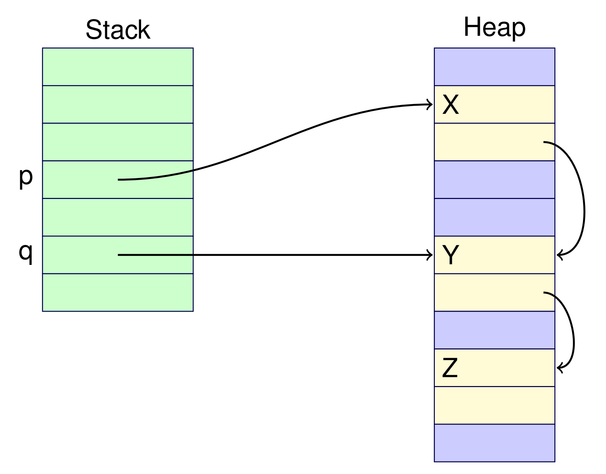

# Week 11.2 &mdash; Memory Allocation and Garbage Collection

## Memory allocation

Dynamic allocation is done on the heap. They have a lifetime longer than their containing procedure, in contrast to stack allocation. 

- This is allocated via new in Java and malloc in C. There are many techniques for allocating memory, including sequential allocation and free list techniques.

- All references to an object may be removed. In this case, the object still uses space but cannot be accessed; this is *garbage*.
- In Java, memory is typed but this is not the case in C.

## Memory deallocation

There are two main forms of memory deallocation in programming languages:

- **explicit deallocation** where there is a function to deallocate an object (free in C), or
- **garbage collection** where the space used by unreachable objects is automatically freed by the garbage collector.

With explicit memory deallocation, freed memory is returned to the free list and adjacent free blocks are merged to reduce fragmentation.

There are many problems with explicit deallocation:

- **Dangling references** (use after free) cause many problems when the invalid reference is reused, which can lead to diabolical bugs (see CSSE2310). 
- **Memory leaks** (memory unreachable but not freed), which will cause out of memory errors in long-running programs.
- **Memory fragmentation** (free memory is sparse and split up) which means there may be many small chunks of free memory but no position for large objects. Memory compaction (defragmentation) is not possible in languages which use fixed addresses like C or C++.
- **Locality of reference** (fragmentation leads to memory being more spread out) in a virtual memory system means more pages of real memory are required. Ideally, related objects would be allocated together which improves cache performance.

## Garbage collection techniques

Some of these issues can be resolved by using a garbage collector. The GC automatically frees unreachable memory and some compact memory to reduce fragmentation and improve locality of reference. An object is accessible if it can be reached directly or via a reference from some other accessible object.

We will look at three garbage collection strategies:

- **Mark and sweep**: Made up of a phase which marks all accessible objects then sweeps the unmarked objects into the free list. In the sweep phase, we unmark marked blocks and we free unmarked blocks.

- **Stop and copy** uses two large spaces of memory for the heap. Memory is allocated sequentially within one space until it runs out. When space runs out, we stop and copy all accessible memory sequentially into the other space.

  During copying, we copy one block at a time. Then, for each pointer in the copied block we determine if it has been copied. If it has not been moved, copy it over then fix the pointer and mark it as copied.

  Some disadvantages are the moving could be slow if objects are large.

- **Generational schemes** use multiple spaces, organised by the length of time objects have survived. The age is measured in the number of times an object has been garbage collected. This means that old objects tend to survive longer, without being moved.

Garbage collection does have some drawbacks:

- It has a greater overhead than explicit deallocation.
- Response time can vary because garbage collection can happen at unexpected times and can take some period of time.
- Real-time response is hard to guarantee. This can be mitigated by preallocating objects, using incremental GC, or using a concurrent GC.
- Garbage collection is complex and especially difficult when doing incremental or concurrent GC.

Incremental GC does small amounts of garbage collection interleaved with execution of the program each time an object is allocated. This avoids large stops, reducing average response time.

A concurrent garbage collector runs in a separate processor, which works well on multiple CPU cores in parallel. They are an "interesting challenge" to verify correctness. Debugging is difficult because they are highly non-deterministic and sensitive to timings.