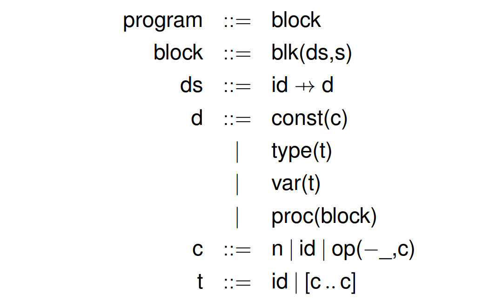
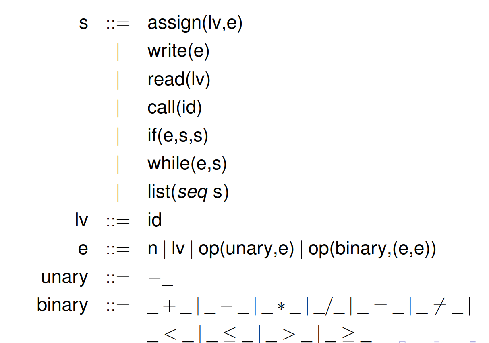
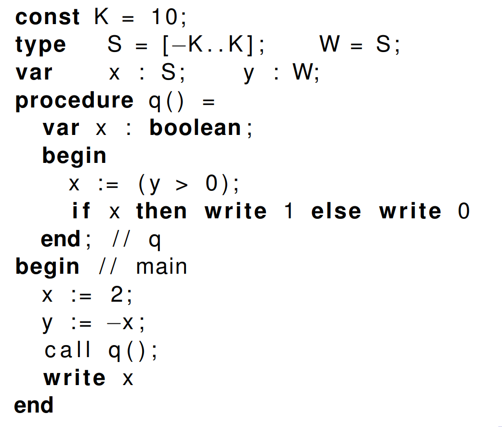
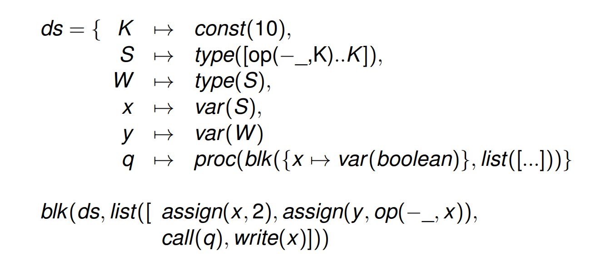
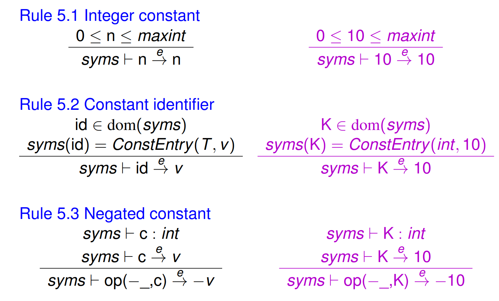
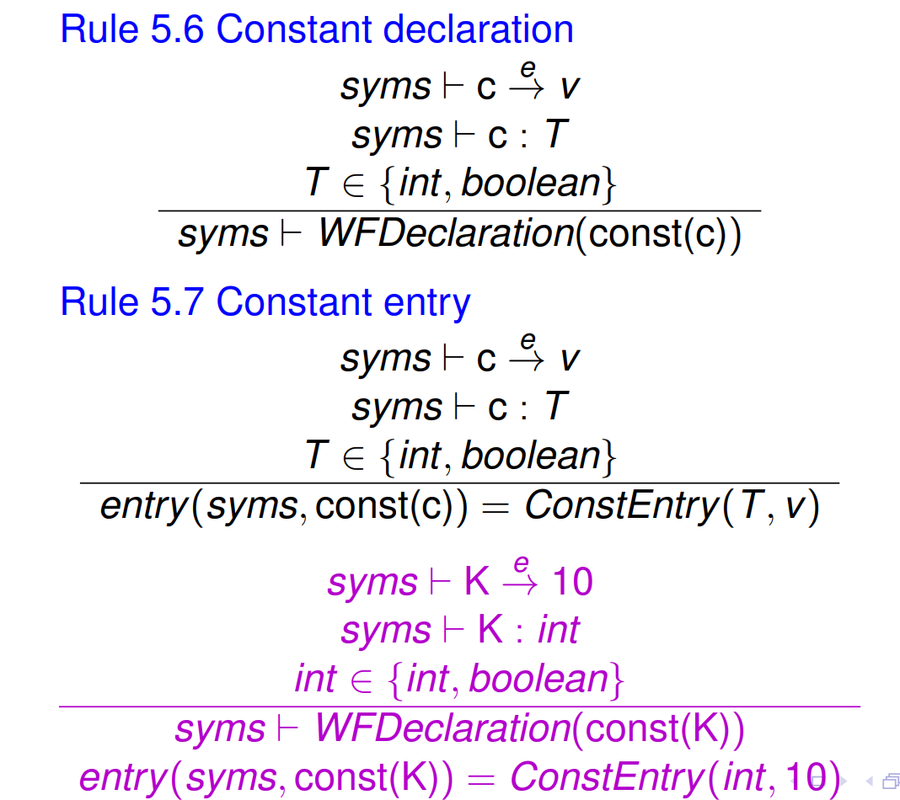
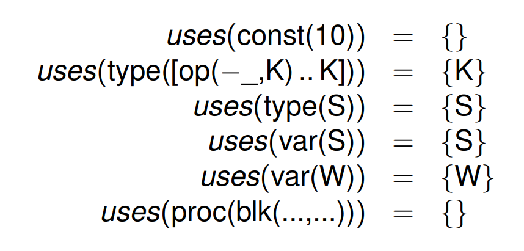
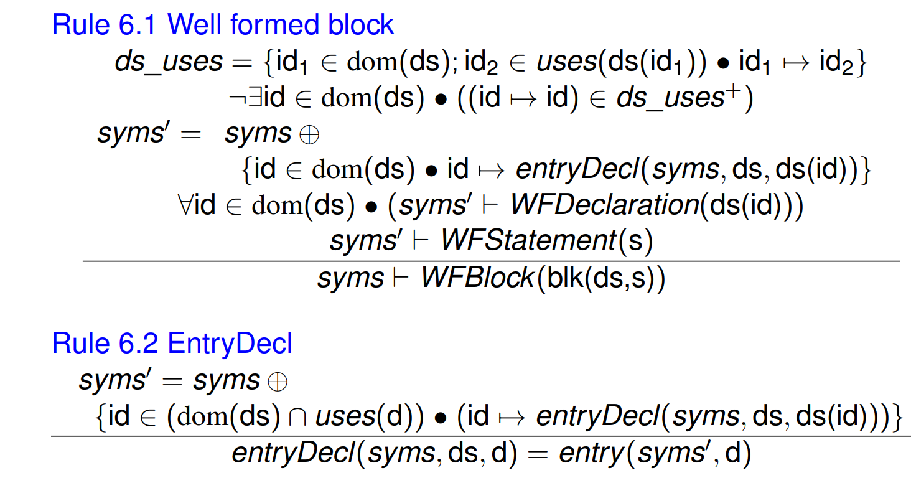

# Week 12.1 &mdash; Static Semantics of Declarations

Recall the abstract syntax of PL0. Here, the notation $\text{id} \to\text{d}$

Above, we can see that the declarations contain the global variables and the procedure. The entry $q$ is a procedure, with its own declaration of the variable $x$.

In PL0 we have these types (internally):

- Scalar types int, boolean, subrange.
- Reference to $T$.
- Product type $T_1 \times T_2$.
- Function types $T_1 \to T_2$.

Recall that a symbol table entry has the form
$$
\operatorname*{SymEntry} := \operatorname*{ConstEntry}(T, \mathbb Z) \mid \operatorname*{TypeEntry}(T) \mid \operatorname*{VarEntry}(T) \mid \operatorname*{ProcEntry}(\text{block}).
$$
and so, $\text{syms} \in \text{id} \mapsto \operatorname*{SymEntry}$. 

In addition to the static semantic rules we have, we can also evaluate expressions in the following way, with the notation $\overset{e}\to$.

We have different rules for determining if a declaration is well-formed and evaluating the entry, using the entry() notation. Note that the entry uses concrete values and the statement form uses symbolic names.

Cycles in dependencies are bad. We define a function uses which when given an expression or type returns the set of identifiers used by the argument. For example,

Looking at the rule for a well-formed block, it contains a block with declarations and statements. The statement must be well-formed in the context of the symbol table augmented with identifiers local to the block, denoted $\oplus$.

Below, the second lines means there is no  identifier which uses its own identifier. The ds_uses is a set of mappings of $\text{id} \to \text{id2}$ where id uses id2. The $+$ notation denotes the transitive closure, including indirect uses.

