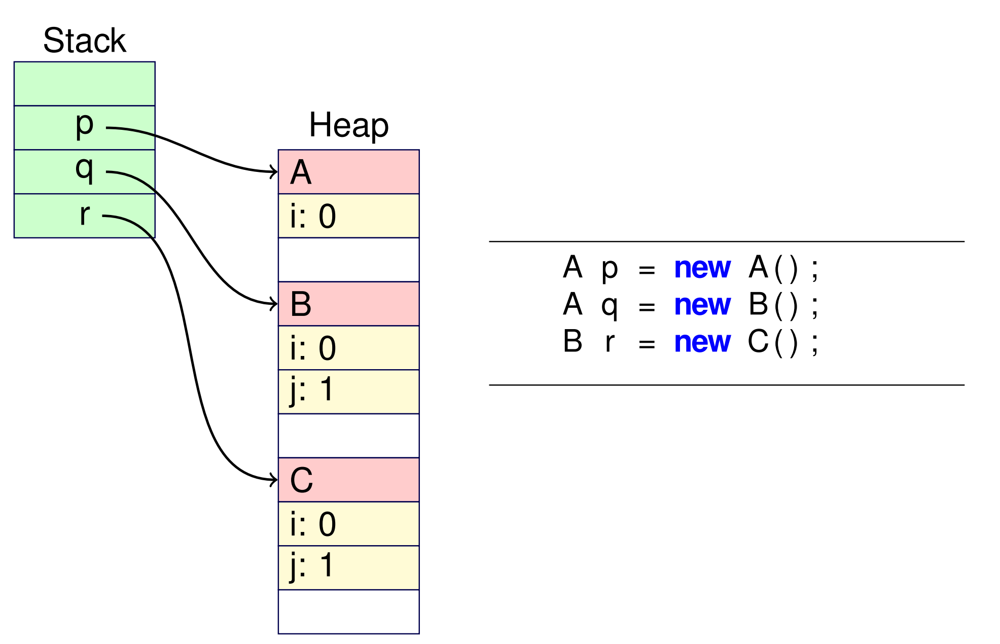

# Week 12.2 &mdash; Runtime Representation of Objects and Classes

Objects are allocated dynamically on the heap (see previous lecture). This means the lifetime of the object may be longer than the lifetime of the containing method. For objects of a particular class type $T$, every field $f$ is at a fixed offset from the start of that object. This makes accessing fields efficient and consistent.

If we say "class S extends T", then S is a subclass of T. It inherits all the fields and methods of T, and the offsets of these inherited fields are the same as T. Additional fields follow and have fixed offsets as well. If S declares a field with the same name as an existing field, it shadows but does not replace T's field.

Consider the following class structure:

After instantiating these classes, we might get the following heap:

We continue with the "class S extends T" example. In this case,

- the subclass S inherits all methods of T but it may override some with new implementations,
- S can add new methods,
- a variable declared to be of type T has a _static_ (declared) type of T and a dynamic (actual) type of T, some subtype of T, or is null, and
- when a non-static method is called, the _dynamic_ type which determines which method is called.

In the above example, calling m on p, q and r calls the m method from A, B and C respectively.

## Dynamic dispatch table

Each class has a dynamic dispatch table. 

- It has an entry for every method of the class, including inherited methods. 
- The entry returns the address of the method's code.
- The entries are at a fixed offset for a particular name.
- Entries for inherited and overridden methods are at the same offsets as their parent.
- The table also contains a pointer to the DDT for its superclass, which is used for super references.

Each object has a reference to the dispatch table for its dynamic type, and the DDT is used to resolve the method at runtime. An example is below. Note that Object is the root type and the DDTs for A, B and C would also include Object's methods (omitted for brevity).

## this reference

The identifier "this" is a reference to the object on which a method was called. It is passed implicitly (or explicitly in Python) as a parameter to the instance method.

## super reference

If "class S extends T", the "super" refers to methods or fields of T. It can be used as a constructor to execute T's constructor, or as an identifier to reference T's fields or methods. 

This can be resolved _statically_ at compile time. Note that the DDT does not need an entry for the constructor, because the constructor is known at compile time before the program is run.

## instanceof operator

The expression "x instanceof T" checks if the dynamic type of x is an instance of T or some subtype of T. This is done by following the DDT's parent link until we reach T and return true or reach the end and return false. The null pointer is not an instance of any type (yet another reason why null should never be used).

## Static fields and methods

Static properties are resolved statically at compile time (hence the name). There is one instance shared by all objects of that class. Static methods are not associated with an instantiated object and so cannot refer to this or call any non-static methods.

## Interfaces

Interfaces provide a specification for some methods. They allow multiple inheritance (in Java) because a class can implement multiple interfaces but can only extend at most one class. They have a more complex runtime implementation. 

Each class that implements an interface (effectively) provides a DDT for that interface which needs to be resolved from both the object's dynamic type and the interface type. Dynamic loading of classes further complicate this.