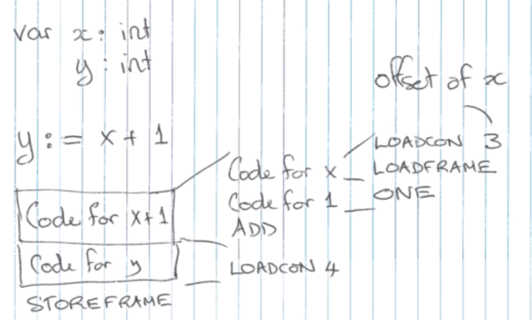

# Week 6.2 &mdash; Stack Machine

The stack machine is a very simple machine which uses a stack to evaluate expressions. This is much simpler than traditional ARM or x86 machines. 

Its stack has two areas: a stack which stores values of expressions and activation records.

## Evaluating using a stack

Consider the expression $2\ 3\ 4\ *\ +$, expressed in reverse Polish notation, which is generated from post-order traversal of an expression tree. This gets loaded into the following instructions:

```assembly
LOADCON 2
LOADCON 3
LOADCON 4
MUL
ADD
```

After executing the first 3 commands, the stack has $[2,3,4]$ with $4$ at the top. MUL pops the top two values, then pushes $3 \times 4=12$ to make the stack $[2,12]$. ADD then does the same to finish with $[14]$.

In general, after running code to evaluate an expression, that expression's value will be on the top of the stack.

Suppose we have a binary operation $e_1 \circ e_2$. This will be represented by these instructions (each evaluate code may be multiple instructions):

```assembly
evaluate e_1
evaluate e_2
ADD
```

Consider code for an assignment $y:= x + 1$, assuming $x = 42$. This would have the following instructions:

```assembly
LOADCON 3  # pushes constant 3, the offset of variable x
LOADFRAME  # goes to offset given by top of stack, and pushes it onto the stack
LOADCON 1  # pushes constant 1
ADD        # adds the value of x and 1, pushing it onto the stack
LOADCON 4  # pushes 4, the offset of y
STOREFRAME # pops an offset, the pops a value and stores that value into the offset
```

This works for local variables; non-local variables will be explained later.



For a more complex example, let's look at 

> if $x < 0$ then $z := -x$ else $x := x$.

The code for this is made up of

```assembly
evaluate x < 0     		# evaluates the condition
(jump if false)     	# if true, continues
evaluate x := -x		# true branch
(jump unconditionally)  # if we ran the true branch, skip false branch
evaluate x := x         # false branch
```

Breaking down the evaluate segments the code is this:

```assembly
LOADCON 3	# push offset of x
LOADFRAME	# pop offset, push value of x
ZERO		# push zero
LESS		# pop x and 0, push x < 0
LOADCON 10	# push number of instructions to skip, 10
BR_FALSE	# pop number to skip and jump if false, i.e. skip true branch
LOADCON 3	# push offset of x
LOADFRAME	# pop offset, push value of x
NEGATE		# pop x, push -x
LOADCON 4	# push offset of z
STOREFRAME	# pop, store z
LOADCON 6	# push skip size of 6
BR			# always pop and skip 6, i.e. skip else branch
LOADCON 3	
LOADFRAME	
LOADCON 4	
STOREFRAME	
```

**Important:** LOADCON instructions have a size of 2 (presumably because they have an opcode and an operand).