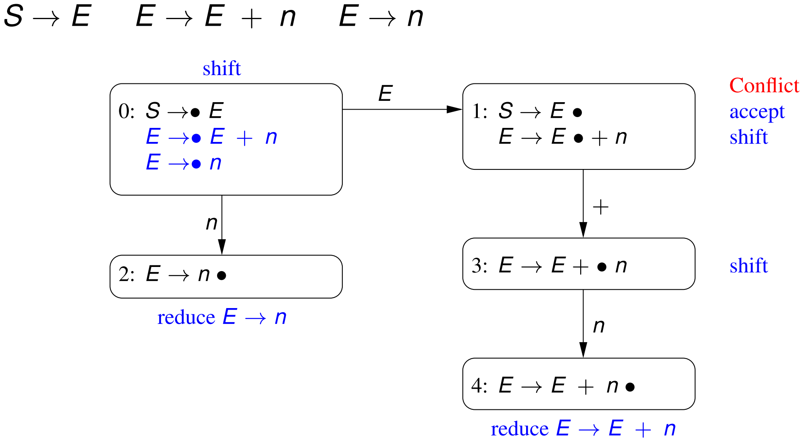

# Week 7.1 &mdash; Bottom-Up, Shift-Reduce and LR Parsing

> April 21, 2020

These are more general parsing than LL(1) RDP and lead to LR(1) and LALR parsing (LALR is used by Java-CUP).

Shift/reduce parsers work bottom up starting from the terminal symbols and end with the start symbol. They make use of a parse stack with three actions:

- *shift* which pushes the next input symbol onto the stack,
- _reduce_ which takes a sequence $\alpha$ on top of the stack matching the right hand side of some production $N \to \alpha$, replacing $\alpha$ with $N$ (opposite of a production), and
- _accept_ which finishes parsing if the stack contains only the start symbol there is no additional input.

Consider a simple grammar
$$
\begin{aligned}S &\to A \\ A &\to (\ A\ ) \\ A &\to \textrm{a}\end{aligned}
$$
The process looks something like this. Note that the symbol $ is used for both the bottom of the stack and end of input.

Note that we need to be careful to shift or reduce appropriately (this will be discussed later).

The trick to shift/reduce is knowing when to shift a terminal onto the stack or perform a reduction. There are many schemes for choosing between shift and reduce actions, including LR(0), SLR(1) (not in this course), LR(1), and LALR(1).

### LR(0) grammars

The name is because we parse _left_ to right, producing a _rightmost_ derivation sequence, with zero symbols lookahead.

An **LR(0) parsing item** is of the form $N \to \alpha \bullet \beta$. This represents that we are trying to match $N$, where have currently matched $\alpha$ and $\beta$ is yet to be matched. 

An **LR(0) parsing automaton** (state machine) consists of a finite set of states, each of which is a set of these LR(0) parsing items. The *kernel item* of the initial state is $S' \to \bullet S$.

#### Derived LR(0) items

If a state has an item of the form $N \to \alpha \bullet M \beta$ with $M \to \alpha_1 \mid \cdots \mid \alpha_m$, then the state also includes the **derived items**, $M \to \bullet \alpha_1,\ \ldots,\ M \to \bullet \alpha_m$.

#### Goto states

Suppose we are at a state $s_i$ with an item of the form $N \to \alpha \bullet \textrm x \beta$ where $\textrm x$ is a single (non-terminal or terminal) symbol. Then, there is a **goto state** $s_j$ from $s_i$ on $\textrm x$. The state $s_j$ then has a kernel item of the form $N \to \alpha \textrm x \bullet \beta$. 

If there are multiple items in $s_i$ with the same $\textrm x$ symbol immediately to the right of the $\bullet$ then the goto state $s_j$ includes *all* those items but with the $\bullet$ after the $\textrm x$.

#### Parsing actions

An LR(0) item of the form:

- $N \to \alpha \bullet \textrm a \beta$ where $\textrm a$ is a terminal symbol, indicates the state containing the item has a *shift* parsing action.
- $S' \to S \bullet$ where $S'$ is the (introduced) start symbol for the grammar, indicates the state containing the item has an *accept* action.
- $N \to \alpha \bullet$ (i.e., there is nothing further to match on the right), where $N$ is not the  start symbol, indicates the state has a parsing action _reduce $N \to \alpha$_.

Note that $N \to \alpha$ is part is a necessary part of the reduce action name. A shift action at end-of-file is an *error*, as is an accept action when the input is not at end-of-file.

#### Example

An example of the stack while parsing using this automaton:

The state is interleaved with the symbols on the stack. When shifting, we look at the current state and the symbol to determine the new state. 

When reducing, we pop the right hand side off the stack and 'replace' it with the left side, considering the preceding state to determine the next state. Compare the second and third reductions in the example and how they lead to $A4$ and $A1$ respectively.

### LR(0) conflicts

There is the possibility that our automaton is non-deterministic for each state. Not every grammar is LR(0). Possible conflicts are:

- shift/reduce conflict,
- reduce/reduce conflict (e.g. $N \to \alpha$ and $M \to \beta$),
- shift/accept conflict,
- accept/reduct conflict.

Note that a shift/shift conflict is impossible. A grammar is **LR(0)** if none of the states in its automaton contains a parsing action conflict.

_Example:_ Below is an example of a state diagram with an accept/shift conflict, so the grammar is *not* LR(0).

Note that this grammar is not very complex which hints that LR(0) is not too powerful. We will look at more powerful LR(1) grammars.