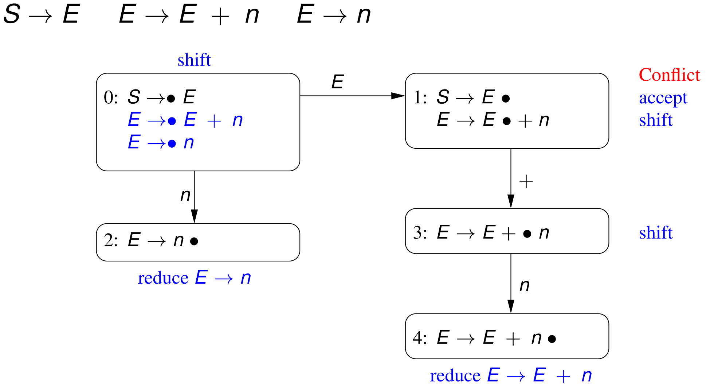
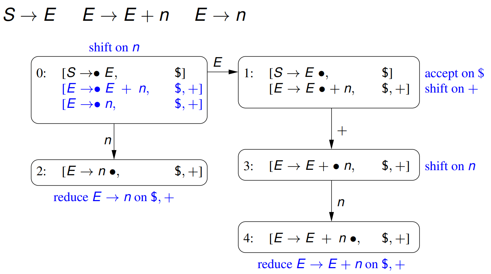
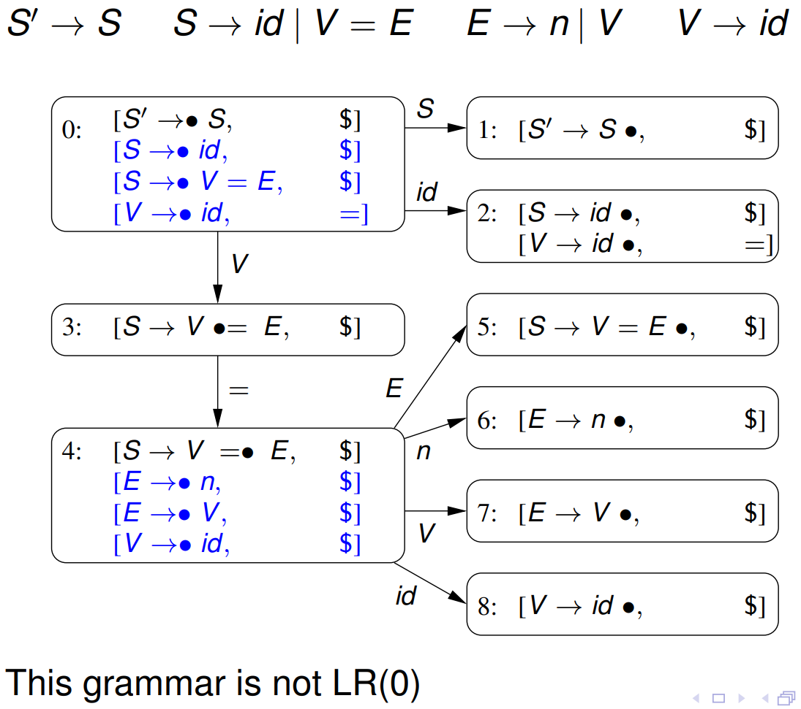
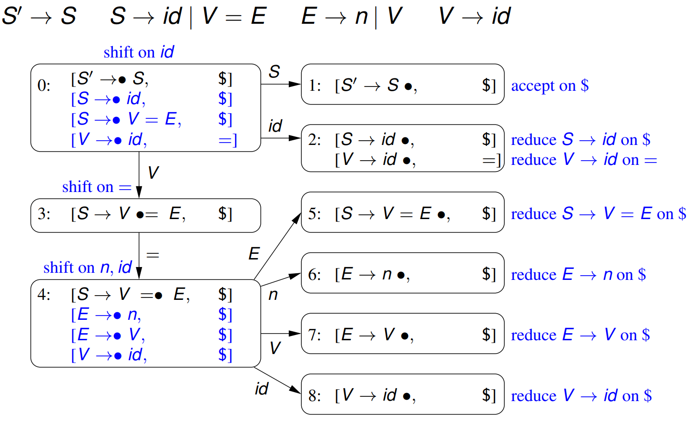
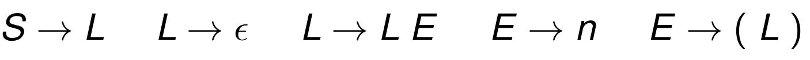
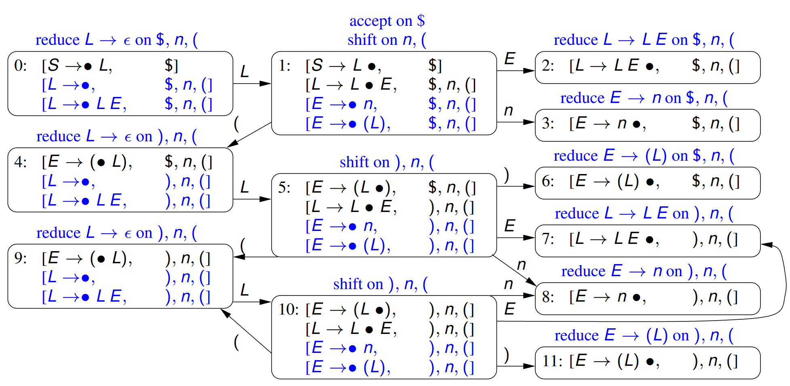
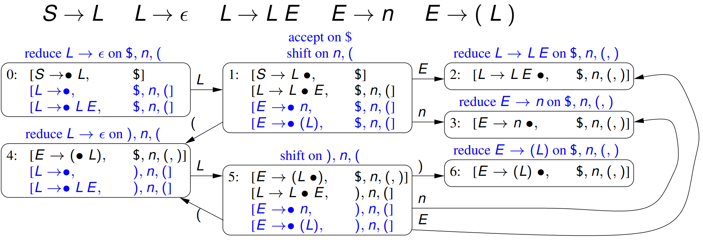

# Week 7.2 &mdash; LR(1) and LALR(1)

Recall our LR(0) automaton which had a shift/accept conflict. In order to be LR(0), the action at each state needs to be unique.

## LR(1) grammars and parsing

**LR(1)** grammars resolve this by adding some lookahead sets to each item. This informs when it should reduce or accept. The name is because:

- parsing is done **left** to right,
- the parser produces a **rightmost** derivation (in reverse), and
- the parser looks one symbol ahead.

**Definition.** An **LR(1) parsing item** is a pair
$$
[N \to \alpha \bullet \beta,\ T]
$$
where $N \to \alpha \bullet \beta$ is just an LR(0) parsing item and $T$ is a set of terminal symbols called a _look-ahead set_. This lookahead set may contain EOF. 

This means that we are trying to match $N$ in a context where $N$ may be followed by a terminal symbol in $T$. As in LR(0), we have matched $\alpha$ and are expecting to match $\beta$.

**Definition.** An **LR(1) parsing automaton** (state machine) consists of a finite set of states, each of which contains a set of LR(1) parsing items.

The **kernel item** of the initial state is
$$
[S' \to \bullet S,\ \{\$\}]
$$
where $S$ is the start symbol of the grammar and we introduce a replacement start symbol $S'$. This determines when parsing is completed.

#### LR(1) state machine construction

If a state has an LR(1) item of the form
$$
[N \to \alpha \bullet M \beta,\ T] \quad \text{where}\quad M \to \alpha_1 \mid \cdots \mid \alpha_m.
$$
and $T = \{\textrm{a}_1, \ldots, \textrm a_n\}$ then the state also includes the **derived items**:
$$
\begin{aligned}
&[M \to \bullet \alpha_1,\ T'] \\ 
&\qquad\quad\vdots\\
&[M \to \bullet \alpha_m,\ T'] 
\end{aligned}
$$
Here, if $\beta$ is not nullable $T' = \operatorname{First} \beta$ and if $\beta$ is nullable, $T' = \operatorname{First}\beta \setminus \{\epsilon\} \cup T$.

If a state $s_i$ has an item of the form $[N \to \alpha \bullet x \beta,\ T]$ where $x$ is a (terminal or non-terminal) symbol, then there is a **goto state** $s_j$ from $s_i$ on $x$ which includes a kernel item of the form
$$
[N \to \alpha x \bullet \beta,\ T].
$$
If $s_i$ has multiple items with the same $x$ to the right of $\bullet$, then $s_j$ includes all those items with the $\bullet$ moved after the $x$.

#### Parsing actions

Parsing actions depend on the next terminal symbol in the input, $x$. Given LR(1) items of the form

- $[N \to \alpha\bullet \text a \beta, T]$ with $\text a$ terminal, indicates a **shift** action if the next input is $\text a$,
- $[S' \to S \bullet, \{\$\}]$ where $S'$ is the added start symbol, indicates an **accept** action if we are at EOF, and
- $[N \to \alpha \bullet, T]$, where $N'$ is not $S$, the state has an action **reduce $N \to \alpha$** if the next input $x$ is in $T$.

If none of the above apply, the parsing action is an **error**.

#### Example 1

Some notes: 

- At 0, the only valid action is shift on n because we only shift on terminals.
- At 1, note that we accept/shift depending on the next input token.
- At 2, we reduce on $ or +.
- At 3, we shift only on n.
- At 4, we reduce on $ or +.

#### Example 2

This abstracts a common pattern in programming languages. $S$ is a statement which describes an assignment or call (without brackets).

- State 0 has two derived items from $S'$ and one from the second $S$ production. Note that because $=$ is not nullable, $T'$ of the $V$ item is just $=$.
- Transition 0 to 2 contains both items which have $\text{id}$ right of $\bullet$.
- State 4 has derived items because non-terminal $E$ is to the right of $\bullet$. This again has multiple derived items.

- Note that we would have had a reduce/reduce conflict at state 2 with LR(0).

#### LR(1) conflicts

We can still have conflicts. Here, they depend on the next input symbol. Possible conflicts are:

- shift/reduce conflict if a state has both a shift and reduce on the terminal $\text b$,
- reduce/reduce for two reduce actions at the same terminal $\text b$,
- shift/accept, and
- accept/reduce.

Again, there is no shift/shift conflict because they are identical. A grammar is LR(1) if none of its states contain a parsing action conflict.

#### Example 3

There are no parsing action conflicts so this grammar is LR(1).

## LALR(1) grammars and parsing

LALR(1) is **look-ahead** merged **LR(1)** parsing. The states of an LALR(1) parsing automaton contain sets of LR(1) items.

It is made from an LR(1) parsing automaton by merging states that have identical sets of LR(0) items but possibly different lookahead sets. The lookahead set is the union of all LR(1) parsing item lookahead sets.

#### Example 3 as LALR(1)

- LALR merged states 2+7, 3+8, 4+9, 5+10, 6+11.
- Note that there are still no conflicts. We can only introduct conflicts if two states have different reduce actions.
- This has the same states as an LR(0) automaton, so if we wanted to construct a LR(0) state machine, we can just omit the lookahead sets.