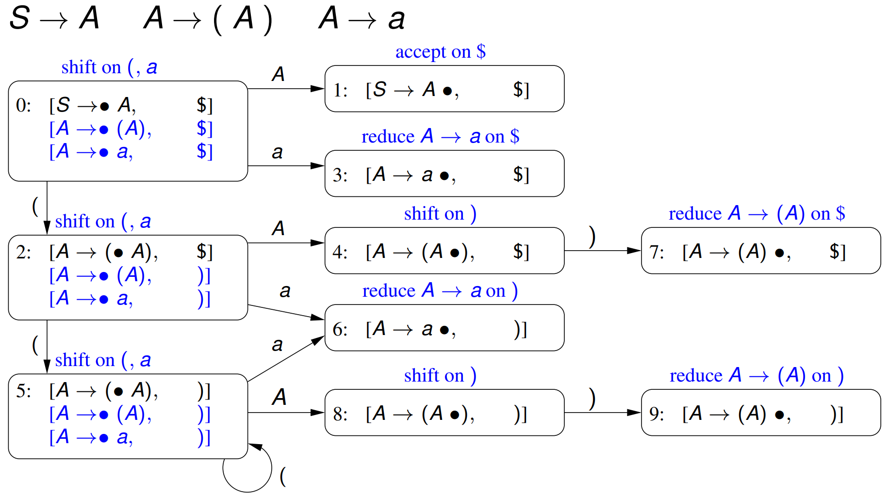
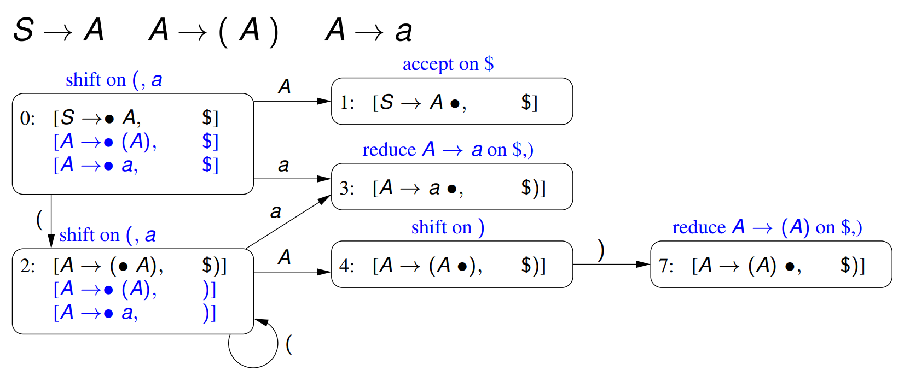

# Week 8.1 &mdash; Java-CUP, Assignment 2

Recall that an LALR(1) parsing automaton is made by merging states of LR(1) with the same parsing items but possibly different lookahead sets.

#### Example 5





## Java-CUP precedence

We can specify precedence for alternatives by specifying something like this, which gives the if part higher precedence than the else part.

```
precedence nonassoc KW_IF;
precedence nonassoc KW_ELSE;
```

## Assignment 2

Due Friday 15th May, weighted 25%.

- Add arrays, enum types and a for statement.

**Enum types** are a new type definition with discrete elements. They can have subranges, declared in the usual way. pred and succ define the preceding and successive elements when given an enum item (wraps around).

**Array types** are indexed by a subrange (of integers or enums) with a specified element type. They have fixed sizes. Elements in an array can be assigned appropriate values and then accessed. Arrays cannot have cyclic type.

**For statements** are a simple for statement over an inclusive range. The iterating variable is local to the for statement. Note that the bounds are evaluated exactly once.

The parser is specified in **PL0.cup** and the lexical tokens are in **PL0.flex**.