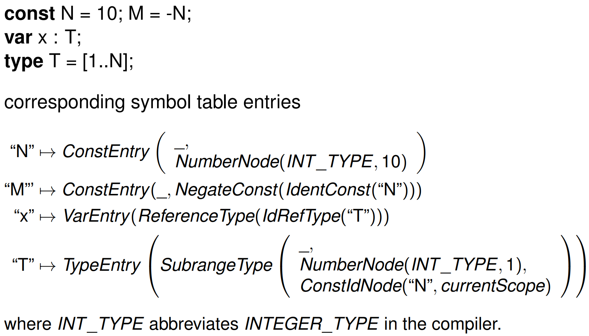

# Week 8.2 &mdash; Symbol Table

Symbol table scopes are what we will look at. A symbol table has entries of the form:

#### Lecture synopsis

- The overall symbol table structure consists of a tree of scopes (mini symbol tables), one for each nested *lexical scope*, i.e., nested procedure (or function).
- Each scope links to its parent scope.
- Each scope has at most one entry for each name and the entry has the relevant information about the name, i.e., whether it is a Constant, Type, Variable, or Procedure, and the additional information required for an entry of that kind.
- When looking up a name the current scope is searched, but if the name is not found its parent scope is searched and so on.
- Handling forward references in constant definitions
- Type.java: representation of type structures (e.g., ProcedureType).
- Handling forward references in type definitions and resolving cyclic type identifier references via IdRefType.
- Handling erroneous cyclic references within constant or type definitions using a status for each identifier of
  - Unresolved: not yet checked
  - Resolving: in the process of resolving the definition, so that in resolving this identifier if we recall resolve for this identifier we have an erroneous cyclic definition
  - Resolved: successfully resolved
- Referencing variables declared in the local scope or more globally
  - For every procedure we introduce a new scope for identifiers.
  - All identifiers defined in a program have a *static level*.
  - The static level of the declarations within a procedure is one higher than the static level of the procedure.
  - The static level of the predefined identifiers ("int", "boolean", "true", "false") is 0.
  - The static level of identifiers declared directly in the main program is 1.
  - A procedure P declared in the main program has static level 1, but any identifiers defined directly within P have static level 2, and so on.
- ReferenceType (and AddressType) and resolution of base type
- ProcedureType and parameters and result type.