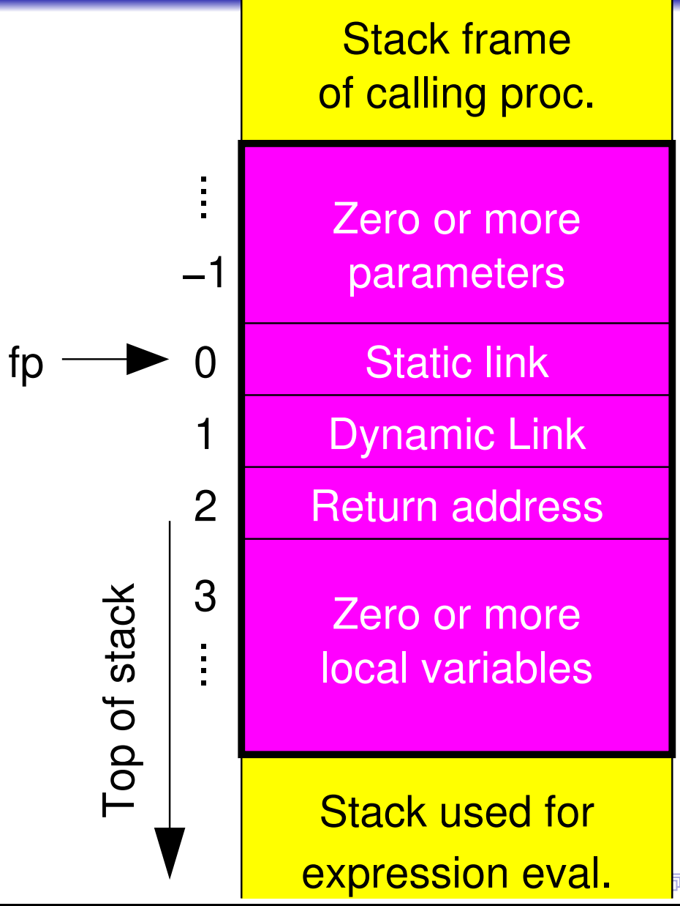
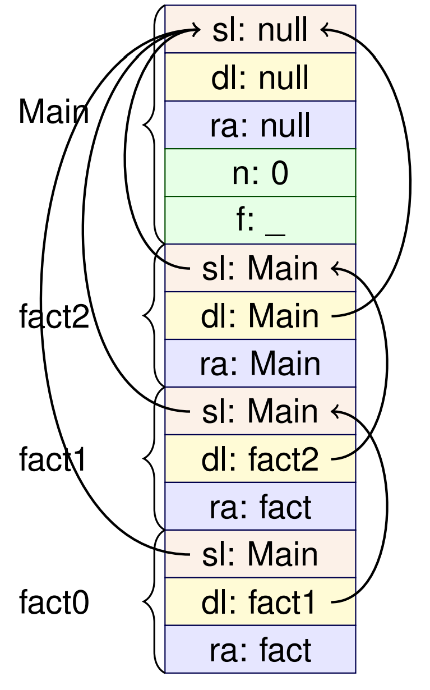

# Week 9 &mdash; Runtime Stack Organisation



- fp is a pointer to offset 0 from the frame pointer. 
- It has a static link which points to the original procedure.
- The dynamic link points to the frame of the calling procedure. 
- The return address points to the address after this expression.
- The rest of the frame is zero or more local variables.

> The **static link** is the base of the stack frame for the most recent activation (call) of the directly enclosing procedure.

When we call a procedure, the following things happen:

1. Parameters (currently none) are pushed onto the stack, with first parameter pushed last.
2. Static link is pushed.
3. Dynamic link, parent frame's frame pointer, is pushed.
4. Return address is pushed.
5. Program counter moved to procedure.
6. Space for local variables is allocated.

The *CALL* instruction implements steps 3&ndash;6.

When we return, this happens:

1. Program counter set to return address
2. Frame pointer set to dynamic link.
3. Stack pointer set so that all space used for stack frame is popped.
4. Execution continues at the new program counter.
5. Calling procedure handles deallocating any parameters.

### Factorial example

```pascal
var n: int; f: int;
procedure fact() =
    begin
        if n = 0 then
        f := 1 // 0! = 1
        else
            begin
            // calculate (n-1)!
            n := n - 1;
            call fact();
            n := n + 1; // restore n
            // calculate n!
            f := f * n
        end
    end; // fact
begin // Main
    n := 2;
    call fact();
    write
    f
end
```

After fact has been called three times, we get to the case $n=0$ and the stack looks like this.

